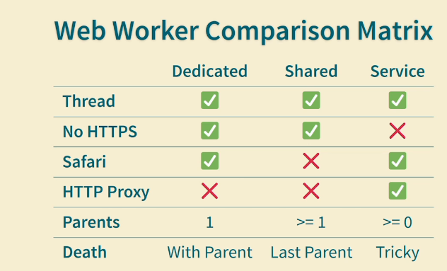

# workers

Overview

- various experiments with [workers](https://developer.mozilla.org/en-US/docs/Web/API)
- nb there are [3 kinds of workers](https://developer.mozilla.org/en-US/docs/Web/API/Web_Workers_API#worker_types):
  - [dedicated workers](https://developer.mozilla.org/en-US/docs/Web/API/Worker) = linked to 1 tab
  - [shared workers](https://developer.mozilla.org/en-US/docs/Web/API/SharedWorker) = can be shared by multiple tabs
  - [service workers](https://developer.mozilla.org/en-US/docs/Web/API/Service_Worker_API) = background sync when web app not open (but browser is)

Links

- [MDN examples](https://github.com/mdn/dom-examples/tree/main/web-workers/simple-web-worker)
- https://www.dhiwise.com/post/web-workers-vs-service-workers-in-javascript
- https://gitnation.com/contents/a-comparison-of-web-workers

